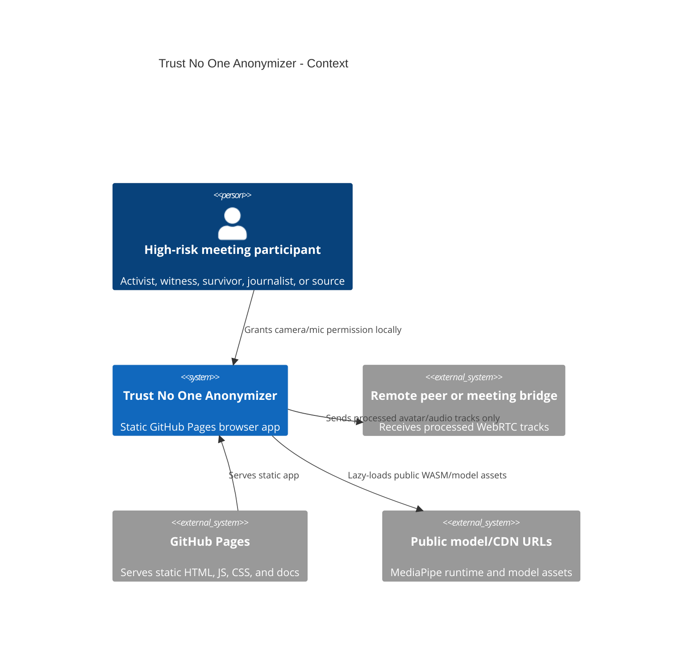
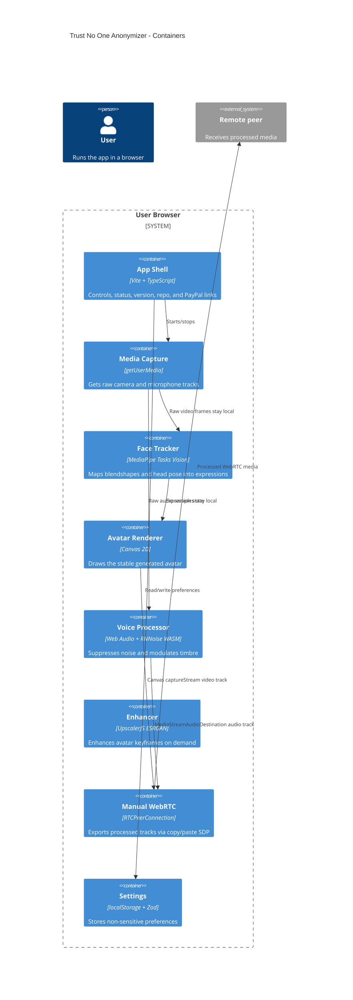

# Architecture

Live site: https://baditaflorin.github.io/trust-no-one-anonymizer/

Repository: https://github.com/baditaflorin/trust-no-one-anonymizer

## C4 Context

## C4 Container

## Runtime Boundary

The GitHub Pages boundary is only static asset delivery. Runtime media processing happens after the page loads, inside the browser. There is no app-owned backend, no server logs, no media upload endpoint, and no analytics beacon.

## Module Boundaries

- `src/features/anonymizer/media/`: raw media acquisition and processed stream composition.
- `src/features/anonymizer/face/`: MediaPipe initialization and expression mapping.
- `src/features/anonymizer/avatar/`: deterministic avatar style and canvas rendering.
- `src/features/anonymizer/audio/`: RNNoise adapter and timbre modulation graph.
- `src/features/anonymizer/enhancement/`: lazy ESRGAN snapshot enhancer.
- `src/features/anonymizer/webrtc/`: manual offer/answer signaling helpers.
- `src/features/anonymizer/settings/`: local settings schema and persistence.
